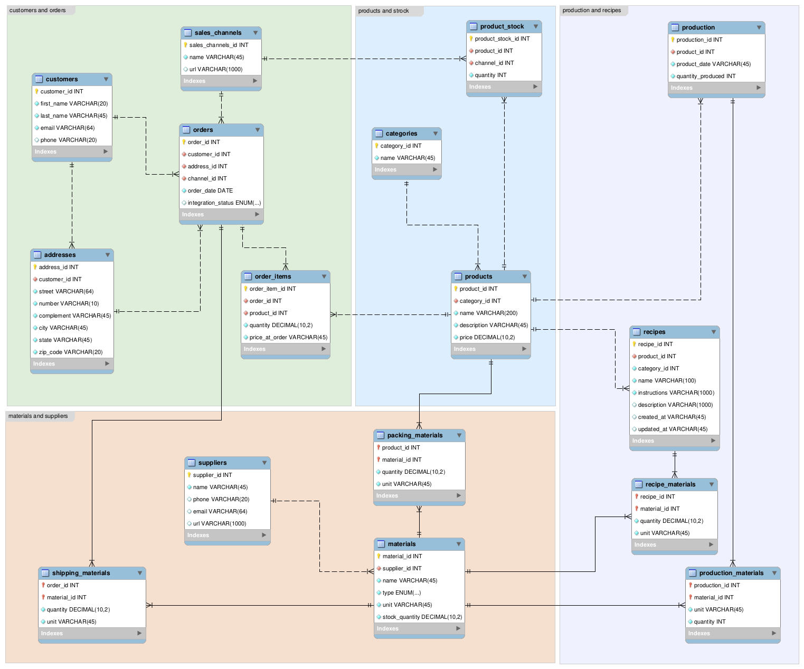

# Lavanza Database

## Project Overview

This project showcases a MySQL-based system designed to manage the operations of Lavanza, a handmade soap business. The structured database organizes essential business data, including customers, orders, products, inventory, production, and suppliers, ensuring efficiency and scalability. It serves as the foundation for future integrations with e-commerce platforms and demonstrates my ability to design normalized, scalable, and efficient relational databases using MySQL.

---

## Database Structure

The database consists of four key sections:



### 1. Customers and Orders
This section manages customer interactions and order processing, supports multiple sales channels for scalability, and ensures accurate order tracking.
- **`customers`** – Stores customer information.
- **`sales_channels`** – Tracks sales channels.
- **`orders`** – Manages order details.
- **`addresses`** – Stores customer addresses.
- **`order_items`** – Links products to orders.

### 2. Products and Stock
This section manages product information and inventory, ensuring well-organized product data and accurate stock tracking. It provides a structured approach to managing products, enables real-time inventory monitoring to prevent stockouts or overstocking.
- **`product_stock`** – Manages inventory levels.
- **`categories`** – Organizes products into categories.
- **`products`** – Stores product details.

### 3. Production and Recipes
This section manages production and recipes, ensuring product consistency, and supports scalability by organizing production data for future growth.
- **`production`** – Tracks soap production batches.
- **`recipes`** – Defines product recipes.
- **`recipe_materials`** – Links materials to recipes.
- **`production_materials`** – Tracks materials used in production.

### 4. Materials and Suppliers
This section manages raw materials and suppliers, centralizing data for efficient material sourcing, ensuring traceability, and supporting cost management.
- **`shipping_materials`** – Manages packaging materials for orders.
- **`suppliers`** – Stores supplier information.
- **`materials`** – Tracks raw materials used in production.
- **`packing_materials`** – Manages materials for product packaging.

---

## Design Principles and Implementation Choices

- **Normalization**: The schema follows 3NF (Third Normal Form), minimizing redundancy to reduce storage requirements and improve query performance. For example, the customers table stores customer details, while the orders table stores order details. This separation ensures that customer information (e.g., name, email) is not duplicated for every order, complying with 3NF.

```sql
CREATE TABLE customers (
    customer_id INT PRIMARY KEY AUTO_INCREMENT,
    first_name VARCHAR(20) NOT NULL,
    last_name VARCHAR(45) NOT NULL,
    email VARCHAR(64) UNIQUE NOT NULL,
    phone VARCHAR(20)
);

CREATE TABLE orders (
    order_id INT PRIMARY KEY AUTO_INCREMENT,
    customer_id INT NOT NULL,
    order_date DATE NOT NULL,
    integration_status ENUM('Pending', 'In Production', 'Produced', 'Packed', 'Shipped', 'Delivered', 'Cancelled') DEFAULT 'Pending',
    FOREIGN KEY (customer_id) REFERENCES customers(customer_id)
);
```

- **Data Types**: Appropriate data types are used to ensure data accuracy and optimize storage. For example, the price column uses DECIMAL(10,2) to ensure precise storage of monetary values, while the integration_status column uses ENUM to restrict values to a predefined set, ensuring data integrity and consistency.

```sql
CREATE TABLE products (
    product_id INT PRIMARY KEY AUTO_INCREMENT,
    name VARCHAR(200) NOT NULL,
    description TEXT,
    price DECIMAL(10,2) NOT NULL
);

CREATE TABLE orders (
    order_id INT PRIMARY KEY AUTO_INCREMENT,
    integration_status ENUM('Pending', 'In Production', 'Produced', 'Packed', 'Shipped', 'Delivered', 'Cancelled') DEFAULT 'Pending'
);
```

- **Indexing**: Primary and foreign keys are indexed to optimize query performance. Primary keys (e.g., customer_id, order_id) are automatically indexed, which accelerates lookups and join operations.

```sql
CREATE TABLE orders (
    order_id INT PRIMARY KEY AUTO_INCREMENT,    -- Automatically indexed
    customer_id INT NOT NULL,
    FOREIGN KEY (customer_id) REFERENCES customers(customer_id)  -- Automatically indexed
);
```

---

## Built With

- **MySQL Workbench:** Used for drawing the ERD (Entity-Relationship Diagram) to visually represent the database structure.
- **MySQL:** Used for designing and implementing the database schema.
- **VS Code:** Used for managing MySQL queries.

---

## How to Run the Project

### 1. Clone the Repository
```bash
git clone https://github.com/larisanti/lavanza-db.git
cd lavanza-db
```

### 2. Import the Database Schema
- Open MySQL and execute the lavanza_db_schema.sql file to create the database and tables:
```bash
mysql -u your_username -p < lavanza_db_schema.sql
``` 

### 3. Populate the Database with Sample Data
- Execute the lavanza_sample_data.sql file to insert sample data into the database:
```bash
mysql -u your_username -p < lavanza_sample_data.sql
```
### 4. Verify the Database
- Connect to MySQL and verify that the database and tables were created successfully:
```bash
mysql -u your_username -p
USE lavanza;
SHOW TABLES;
```

### 5. Explore the Data
- Run queries to explore the data:
```bash
SELECT * FROM customers;
SELECT * FROM orders;
```

---

## License
This project is licensed under the MIT License. For more details, see the [LICENSE](LICENSE) file.

